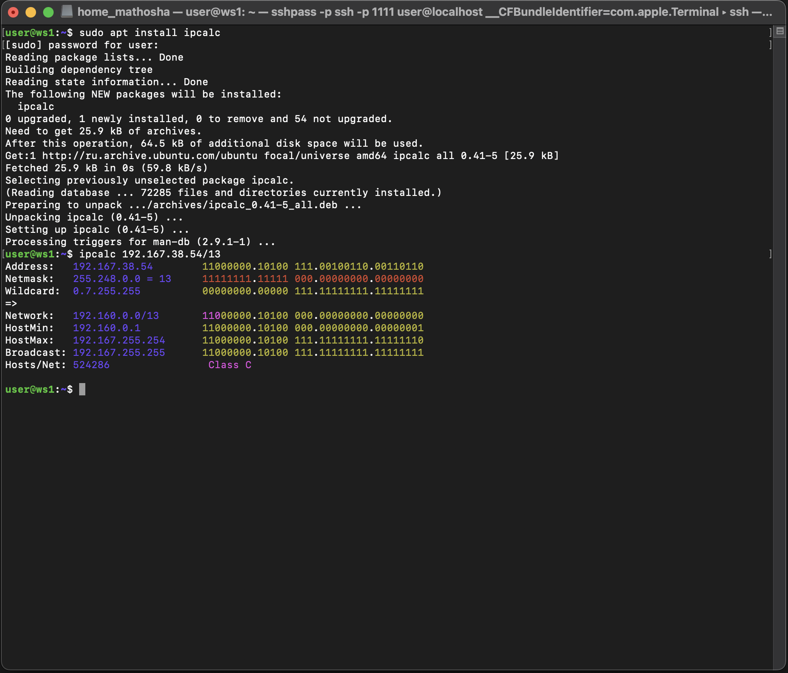

# DO2_LinuxNetwork-1

## Содержание

1. [Part 1. Инструмент ipcalc](#Part-1-Инструмент-ipcalc)
2. [Перевод масок в разные формы](#перевод-масок-в-разные-формы)
3. [Минимальный и максимальный хост для сети 12.167.38.4](#минимальный-и-максимальный-хост-для-сети-12167384)

---

## Part 1. Инструмент ipcalc

## 1.1. Сети и маски
### 1) Адрес сети 192.167.38.54/13

Мы будем использовать утилиту **ipcalc**. Откроем терминал на виртуальной машине **ws1** и введем:

```
ipcalc 192.167.38.54/13
```



### Результат:

- Network: 192.160.0.0/13
- Netmask: 255.248.0.0 = 13 бит
- Broadcast: 192.167.255.255
- Диапазон IP: от 192.160.0.1 до 192.167.255.254

Смотрим пункт Network. Таким образом наш адрес сети для **192.167.38.54/13** — **192.160.0.0**.

---

## 2) Перевод маски 255.255.255.0 в префиксную и двоичную запись, /15 в обычную и двоичную, 11111111.11111111.11111111.11110000 в обычную и префиксную

### Для перевода маски 255.255.255.0 в префиксную и двоичную запись, откроем терминал на виртуальной машине ws1 и введем команду:

```
ipcalc 255.255.255.0
```


Результат:
- Префиксная запись: /24

Объяснение: Префикс /24 означает, что первые 24 бита маски — это единицы (1), а оставшиеся 8 бит — нули (0). Это означает, что все IP-адреса с такой маской находятся в одной сети.

- Двоичная запись: 11111111.11111111.11111111.00000000

Объяснение: В двоичной форме первые 24 бита — это единицы (1), которые составляют три октета (по 8 бит), а последний октет (8 бит) — это нули (0).


### Перевод префикса /15 в обычную (десятичную) и двоичную запись

Для перевода префикса /15 в обычную и двоичную запись, введем команду с любым IP (IP в данном случае не важен):

```
ipcalc 192.0.0.0/15
```


Результат:
- Обычная (десятичная) запись: 255.254.0.0

Объяснение: Префикс /15 означает, что первые 15 бит — это единицы (1), а оставшиеся 17 бит — нули (0).

- Двоичная запись:
11111111.11111110.00000000.00000000

Объяснение: Первые 15 бит — это единицы, остальные 17 бит — нули.

### Перевод маски 11111111.11111111.11111111.11110000 в обычную (десятичную) и префиксную запись

Чтобы перевести эту маску в обычную (десятичную) запись, мы берём каждый октет из двоичной записи и переводим его в десятичное число:

11111111 (8 единиц) = 255

11111111 (8 единиц) = 255

11111111 (8 единиц) = 255

11110000 (4 единицы, 4 нуля) = 240

Теперь соберем их вместе, и наша маска в десятичной записи выглядит так:

255.255.255.240

Теперь вводим команду:

```
ipcalc 255.255.255.240
```


- Результат:
Обычная (десятичная) запись: 255.255.255.240

Объяснение: Эта маска в двоичной форме состоит из 28 единиц и 4 нулей.

- Префиксная запись: /28

Объяснение: Префикс /28 означает, что первые 28 бит — это единицы (1), а оставшиеся 4 бита — нули.

## 3) минимальный и максимальный хост в сети 12.167.38.4 при масках: /8, 11111111.11111111.00000000.00000000, 255.255.254.0 и /4

### Маска /8 для сети 12.167.38.4

Откроем терминал на виртуальной машине ws1 и введем команду:

```
ipcalc 12.167.38.4/8
```


Результат:

- Минимальный хост: 12.0.0.1

Объяснение: Это первый доступный IP-адрес в диапазоне сети, который можно использовать для хоста.

- Максимальный хост: 12.255.255.254

Объяснение: Это последний доступный IP-адрес, который можно использовать для хоста, не включая широковещательный адрес (broadcast).

### Маска 11111111.11111111.00000000.00000000 (это эквивалентно /16)

Теперь маска 11111111.11111111.00000000.00000000 — это двоичная запись, которая эквивалентна префиксу /16. Выполним команду в терминале:

```
ipcalc 12.167.38.4/16
```


Результат:

- Минимальный хост: 12.167.0.1

Объяснение: Это первый IP-адрес в диапазоне сети, который может быть использован для хоста.

- Максимальный хост: 12.167.255.254

Объяснение: Это последний доступный IP-адрес для хоста в этой сети.

### Маска 255.255.254.0 (эквивалентно /23)

Для маски 255.255.254.0, которая эквивалентна префиксу /23, введем следующую команду:

```
ipcalc 12.167.38.4/23
```


Результат:

- Минимальный хост: 12.167.38.1

Объяснение: Это первый доступный IP-адрес для хоста.

- Максимальный хост: 12.167.39.254

Объяснение: Это последний доступный IP-адрес для хоста в этой сети.

### Маска /4 для сети 12.167.38.4

Теперь для маски /4 выполним команду:

```
ipcalc 12.167.38.4/4
```


Результат:

- Минимальный хост: 0.0.0.1

Объяснение: Это первый IP-адрес, который может быть использован для хоста.

- Максимальный хост: 15.255.255.254

Объяснение: Это последний доступный IP-адрес для хоста в этой сети.


## 1.2. localhost

Для вычисления того, можно ли обратиться к localhost с определенных IP-адресов, можно использовать команду ping и проверить, доступны ли эти IP-адреса на локальном уровне. Вот шаги, которые нужно выполнить через терминал.

Шаги для проверки через терминал
Мы будем использовать команду ping для каждого IP-адреса, чтобы проверить, доступен ли он как localhost.


1) Проверка IP 194.34.23.100
Открой терминал на виртуальной машине ws1 и введи команду:

```
ping 194.34.23.100
```

Ожидаемый результат:

194.34.23.100 не является localhost-адресом, поэтому запрос вернется с ошибкой или ответом о недоступности.

Это внешний IP, и он не принадлежит сети 127.0.0.0/8.

Вывод:

194.34.23.100 не может быть использован для обращения к localhost.

2) Проверка IP 127.0.0.2

Теперь проверим IP-адрес 127.0.0.2. Введем команду в терминале:

```
ping 127.0.0.2
```

Ожидаемый результат:

Поскольку 127.0.0.2 находится в сети 127.0.0.0/8, он будет работать как localhost.

Ответы от 127.0.0.2 будут успешными, так как этот IP принадлежит диапазону loopback.

Вывод:

127.0.0.2 можно использовать для обращения к localhost.

3) Проверка IP 127.1.0.1

Проверим следующий IP 127.1.0.1:

```
ping 127.1.0.1
```

Ожидаемый результат:

Поскольку 127.1.0.1 также находится в сети 127.0.0.0/8, команда ping должна вернуть успешный ответ.

Этот адрес работает как localhost.

Вывод:

127.1.0.1 можно использовать для обращения к localhost.

4) Проверка IP 128.0.0.1

Наконец, проверим IP 128.0.0.1:

```
ping 128.0.0.1
```

Ожидаемый результат:

Этот IP не принадлежит сети 127.0.0.0/8, поэтому он не будет работать как localhost.

Команда ping вернет ошибку или сообщение о том, что данный адрес недоступен.

Вывод:

128.0.0.1 не может быть использован для обращения к localhost.

Также это можно было проверить через ipcalc. Localhost принадлежит сети 127.0.0.0/8 и при вычислении если ip адрес не принадлежит сети /8 то он не будет работать как localhost.

## 1.3 Диапазоны и сегменты сетей

### 1) какие из перечисленных IP можно использовать в качестве публичного, а какие только в качестве частных: 10.0.0.45, 134.43.0.2, 192.168.4.2, 172.20.250.4, 172.0.2.1, 192.172.0.1, 172.68.0.2, 172.16.255.255, 10.10.10.10, 192.169.168.1

Частные IP-адреса используются только внутри локальных сетей и не могут быть видны или использованы в интернете. Основные диапазоны частных IP-адресов:

10.0.0.0 — 10.255.255.255 (диапазон /8)

172.16.0.0 — 172.31.255.255 (диапазон /12)

192.168.0.0 — 192.168.255.255 (диапазон /16)

Публичные IP-адреса могут использоваться для связи в интернете и видимы за пределами локальной сети. Это все IP-адреса, которые не попадают в частные диапазоны.

Определение IP-адресов:

1) 10.0.0.45

Диапазон: 10.0.0.0 — 10.255.255.255

Вывод: Частный IP (так как он принадлежит диапазону частных адресов 10.0.0.0/8)

2) 134.43.0.2

Диапазон: 134.0.0.0 — 134.255.255.255

Вывод: Публичный IP (этот IP не принадлежит частным диапазонам, следовательно, он публичный)

3) 192.168.4.2

Диапазон: 192.168.0.0 — 192.168.255.255

Вывод: Частный IP (принадлежит частному диапазону 192.168.0.0/16)

4) 172.20.250.4

Диапазон: 172.16.0.0 — 172.31.255.255

Вывод: Частный IP (принадлежит частному диапазону 172.16.0.0/12)

5) 172.0.2.1

Диапазон: 172.0.0.0 — 172.15.255.255

Вывод: Публичный IP (не принадлежит частному диапазону 172.16.0.0/12, значит, это публичный IP)

6) 192.172.0.1

Диапазон: 192.172.0.0 — 192.172.255.255

Вывод: Публичный IP (не входит в частный диапазон 192.168.0.0/16, значит, это публичный IP)

7) 172.68.0.2

Диапазон: 172.0.0.0 — 172.255.255.255

Вывод: Публичный IP (не попадает в частный диапазон 172.16.0.0/12, это публичный IP)

8) 172.16.255.255

Диапазон: 172.16.0.0 — 172.31.255.255

Вывод: Частный IP (принадлежит частному диапазону 172.16.0.0/12)

9) 10.10.10.10

Диапазон: 10.0.0.0 — 10.255.255.255

Вывод: Частный IP (принадлежит частному диапазону 10.0.0.0/8)

10) 192.169.168.1

Диапазон: 192.169.0.0 — 192.169.255.255

Вывод: Публичный IP (не входит в частный диапазон 192.168.0.0/16, значит, это публичный IP)

Итоговое решение:

- 10.0.0.45 — Частный IP
- 134.43.0.2 — Публичный IP
- 192.168.4.2 — Частный IP
- 172.20.250.4 — Частный IP
- 172.0.2.1 — Публичный IP
- 192.172.0.1 — Публичный IP
- 172.68.0.2 — Публичный IP
- 172.16.255.255 — Частный IP
- 10.10.10.10 — Частный IP
- 192.169.168.1 — Публичный IP


### 2) какие из перечисленных IP адресов шлюза возможны у сети 10.10.0.0/18: 10.0.0.1, 10.10.0.2, 10.10.10.10, 10.10.100.1, 10.10.1.255


Маска /18 означает, что первые 18 битов маски сети используются для обозначения сети, а оставшиеся 14 битов — для хостов.

Диапазон IP-адресов в сети 10.10.0.0/18 начинается с 10.10.0.1 (первый доступный хост) и заканчивается 10.10.63.254 (последний доступный хост).

Шлюз должен находиться в пределах этого диапазона.

Диапазон сети 10.10.0.0/18:

Начальный адрес сети: 10.10.0.0 (это адрес сети, его нельзя использовать для хостов).

Первый возможный хост: 10.10.0.1

Последний возможный хост: 10.10.63.254

Широковещательный адрес: 10.10.63.255 (его тоже нельзя использовать для хостов).

Теперь определим, какие из указанных IP-адресов попадают в этот диапазон.

Проверим каждый IP-адрес:
1) 10.0.0.1
Диапазон сети: 10.0.0.0 — 10.0.0.255 (не входит в диапазон 10.10.0.0/18).
Вывод: Этот IP-адрес находится вне сети 10.10.0.0/18, его нельзя использовать в качестве шлюза.
2) 10.10.0.2
Диапазон сети: 10.10.0.0 — 10.10.63.255 (входит в диапазон).
Вывод: Этот IP-адрес находится в пределах сети 10.10.0.0/18, его можно использовать в качестве шлюза.
3) 10.10.10.10
Диапазон сети: 10.10.0.0 — 10.10.63.255 (входит в диапазон).
Вывод: Этот IP-адрес также находится в пределах сети 10.10.0.0/18, его можно использовать в качестве шлюза.
4) 10.10.100.1
Диапазон сети: 10.10.64.0 — 10.10.127.255 (это уже следующая сеть, не входит в диапазон 10.10.0.0/18).
Вывод: Этот IP-адрес находится вне сети 10.10.0.0/18, его нельзя использовать в качестве шлюза.
5) 10.10.1.255
Диапазон сети: 10.10.0.0 — 10.10.63.255 (входит в диапазон).
Вывод: Этот IP-адрес находится в пределах сети 10.10.0.0/18, его можно использовать в качестве шлюза.

Итоговое решение:

- 10.0.0.1 — Нельзя использовать (вне сети).
- 10.10.0.2 — Можно использовать (в пределах сети).
- 10.10.10.10 — Можно использовать (в пределах сети).
- 10.10.100.1 — Нельзя использовать (вне сети).
- 10.10.1.255 — Можно использовать (в пределах сети).


## Part 2. Статическая маршрутизация между двумя машинами

Меняем настройки сети в VirtualBox:


Вывод команды ip a на обеих машинах:


### Описать сетевой интерфейс, соответствующий внутренней сети, на обеих машинах и задать следующие адреса и маски: ws1 - 192.168.100.10, маска /16, ws2 - 172.24.116.8, маска /12

> ` netstat -nr `

- ` -n ` - отбражение адресов в числовом виде;
- ` -r ` - отображение в виде таблицы.


Задаем следующие адреса и маски: ws1 - 192.168.100.10, маска /16, ws2 - 172.24.116.8, маска /12:


...и снова проверяем, что все применилось:


## 2.1. Добавление статического маршрута вручную

Добавиv статический маршрут от одной машины до другой и обратно при помощи команды вида ip r add:


Пропингуем соединение между машинами:


## 2.2. Добавление статического маршрута с сохранением

Перезапустим машины, и убедимся, что данные не сохранились:


Добавим статический маршрут от одной машины до другой с помощью файла etc/netplan/00-installer-config.yaml и применим новые настройки с помощью команды `sudo netplan apply`:


Пропингуем соединение между машинами:


## Part 3. Утилита iperf3

### 3.1. Скорость соединения

### 8 Mbps (Мегабит в секунду) в MB/s (Мегабайт в секунду)

`1 байт = 8 бит`

Чтобы перевести Мегабиты в Мегабайты, нужно разделить значение в Мегабитах на 8.

Формула: `MB/s = Mbps 8 MB/s = 8 Mbps`


Подставим значение: `MB/s = 8/8 = 1 MB/s MB/s= 8/8 = 1 MB/s`

Ответ: `8 Mbps = 1 MB/s`

---

###  100 MB/s (Мегабайт в секунду) в Kbps (Килобит в секунду)

1 байт = 8 бит

1 Мегабайт = 1 000 000 байт (в десятичной системе)

1 Килобит = 1 000 бит (в десятичной системе)

Чтобы перевести Мегабайты в Килобиты, нужно умножить на 8 (чтобы получить биты), а затем умножить на 1 000 (чтобы перевести в Килобиты).

Формула: `Kbps = MB/s × 8 × 1000 Kbps = MB/s ×8 × 1000`

Подставим значение: `Kbps = 100 × 8 × 1000 = 800000 Kbps`

`Kbps = 100 × 8 × 1000 = 800000 Kbps`

Ответ:
100 MB/s = 800 000 Kbps

---

### 1 Gbps (Гигабит в секунду) в Mbps (Мегабит в секунду)

1 Гигабит = 1 000 Мегабит

Формула: `Mbps = Gbps × 1000 Mbps = Gbps × 1000`

Подставим значение: `Mbps = 1 × 1000 = 1000  Mbps`

`Mbps = 1 × 1000 = 1000 Mbps`

Ответ: `1 Gbps = 1 000 Mbps`

Результаты:

`8 Mbps = 1 MB/s`

`100 MB/s = 800 000 Kbps`

`1 Gbps = 1 000 Mbps`

## 3.2. Утилита iperf3

Для подготовки к выполнению данного задания, я настроил два адаптера в VirtualBox. Первый адаптер я настроил как `NAT`, а второй как `Внутренняя сеть` с названием `intnet`.


Далее для добавления новых интерфейсов я внес изменения в файл `/etc/netplan/00-installer-config.yaml`:

Изначально он был таким:

```
network:
  ethernets:
    enp0s3:
      dhcp4: no
      addresses: [192.168.100.10/16]
      routes:
        - to: 172.24.116.8
          via: 192.168.100.10
  version: 2
```

После изменения:

```
network:
  ethernets:
    enp0s8:
      dhcp4: no
      addresses: [192.168.100.10/16]
      routes:
        - to: 172.24.116.8
          via: 192.168.100.10
    enp0s3:
      dhcp4: yes
  version: 2
```

Описание изменений:
Изначальная конфигурация:

У нас был один интерфейс, enp0s3, который использовался для внутренней сети. Этот интерфейс был настроен со статическим IP-адресом 192.168.100.10/16 и использовался для связи внутри сети (например, между виртуальными машинами).
Однако у нас не было доступа в интернет или подключения по SSH через NAT, так как NAT не был настроен.

Что изменилось:
Мы добавили второй сетевой интерфейс — enp0s8 — и перенесли на него внутреннюю сеть с IP-адресом 192.168.100.10/16. Оставили enp0s3 как интерфейс для NAT, то есть подключили его к сети через NAT, чтобы получать доступ в интернет и для возможности подключения по SSH через внешний терминал.

enp0s3 теперь настроен на DHCP, то есть он получает IP-адрес автоматически и обеспечивает подключение через NAT.

Цель изменений:

Разделение функций сетевых интерфейсов:

enp0s3 теперь используется для NAT. Это означает, что он обеспечивает доступ к интернету и внешним ресурсам (например, для подключения по SSH).

enp0s8 используется для внутренней сети, обеспечивая связь между виртуальными машинами внутри сети с фиксированным IP-адресом.


## 3.2. Утилита iperf3

### Что такое iperf3?

iperf3 — это утилита, которая используется для измерения скорости соединения между двумя машинами. Она позволяет проверить, насколько быстро данные могут передаваться по сети от одной машины к другой. С помощью iperf3 можно легко узнать пропускную способность сети между вашими виртуальными машинами, серверами или другими сетевыми устройствами.

### Как работает iperf3?

iperf3 работает по принципу "клиент-сервер". Одна машина работает как сервер (принимает данные), а другая — как клиент (отправляет данные).
Клиент соединяется с сервером, и они начинают обмениваться данными, чтобы измерить скорость соединения (обычно в Мегабитах в секунду, Mbps).

### Синтаксис команд iperf3

Основные команды:

`iperf3 -s` — запускает сервер. Этот сервер будет ждать подключения клиента для измерения скорости.

`iperf3 -c [IP-адрес]` — запускает клиент, который подключается к серверу, указанному по IP-адресу, и начинает тестировать скорость соединения.

Теперь замерим скорость соединения между машинами ws1 и ws2 с помощью iperf3.

1) Установим iperf3 на обе машины с помощью команды `sudo apt install iperf3`


2) Запустим iperf3 на ws2 в режиме сервера с помощью команды `iperf3 -s`. Флаг `-s` означает, что `ws2` работает как сервер.


3) Запустим `iperf3` на `ws1` в режиме клиента и замерим скорость соединения со второй машиной `ws2` с помощью команды `iperf3 -c 172.24.116.8`. Флаг `-c` означает, что `ws1` работает как клиент и подключается к серверу по указанному IP-адресу.


В полученной информации, мы видим:

- Transfer, который показывает, сколько данных было передано.
- Bandwidth, который показывает пропускную способность (скорость) соединения в Mbps.

## Part 4. Сетевой экран

### Что такое iptables?

iptables — это утилита, которая управляет правилами файрволла в Linux. Она позволяет контролировать, какие соединения (входящие и исходящие) разрешены или запрещены на уровне сетевого трафика.

### Настройка правил на ws1 (запрещающее правило в начале)

На ws1 мы применим стратегию, когда в начале идет запрещающее правило, а разрешающее — в конце. Добавим правила для SSH, HTTP, блокировки и разрешения ICMP (ping).


Добавляем правила в файл /etc/firewall.sh на ws1:


```
#!/bin/sh

# Удаление всех текущих правил
iptables -F
iptables -X

# Стратегия: запрещающее правило в начале, разрешающее в конце

# 1. Запретить все входящие соединения по умолчанию (по цепочке INPUT)
iptables -P INPUT DROP

# 2. Открыть доступ к порту 22 (SSH)
iptables -A INPUT -p tcp --dport 22 -j ACCEPT

# 3. Открыть доступ к порту 80 (HTTP)
iptables -A INPUT -p tcp --dport 80 -j ACCEPT

# 4. Запретить ICMP echo reply (не пинговаться, блокировка на OUTPUT)
iptables -A OUTPUT -p icmp --icmp-type echo-reply -j DROP

# 5. Разрешить ICMP echo reply (пинговаться)
iptables -A OUTPUT -p icmp --icmp-type echo-reply -j ACCEPT
```

Объяснение:

iptables -P INPUT DROP — запрещает все входящие соединения по умолчанию.

-A INPUT -p tcp --dport 22 -j ACCEPT — разрешает входящие соединения на порт 22 (SSH).

-A INPUT -p tcp --dport 80 -j ACCEPT — разрешает входящие соединения на порт 80 (HTTP).

-A OUTPUT -p icmp --icmp-type echo-reply -j DROP — запрещает исходящие ICMP-ответы (машина не будет пинговаться).

-A OUTPUT -p icmp --icmp-type echo-reply -j ACCEPT — разрешает ICMP-ответы (машина будет пинговаться).

### Настройка правил на ws2 (разрешающее правило в начале)

На ws2 стратегия обратная — вначале разрешающее правило, а запрещающее — в конце.

Добавляем правила в файл /etc/firewall.sh на ws2:

```
#!/bin/sh

# Удаление всех текущих правил
iptables -F
iptables -X

# Стратегия: разрешающее правило в начале, запрещающее в конце

# 1. Разрешить все входящие соединения по умолчанию (по цепочке INPUT)
iptables -P INPUT ACCEPT

# 2. Открыть доступ к порту 22 (SSH)
iptables -A INPUT -p tcp --dport 22 -j ACCEPT

# 3. Открыть доступ к порту 80 (HTTP)
iptables -A INPUT -p tcp --dport 80 -j ACCEPT

# 4. Разрешить ICMP echo reply (пинговаться)
iptables -A OUTPUT -p icmp --icmp-type echo-reply -j ACCEPT

# 5. Запретить ICMP echo reply (не пинговаться)
iptables -A OUTPUT -p icmp --icmp-type echo-reply -j DROP
```

Объяснение:

iptables -P INPUT ACCEPT — разрешает все входящие соединения по умолчанию.

-A INPUT -p tcp --dport 22 -j ACCEPT — разрешает входящие соединения на порт 22 (SSH).

-A INPUT -p tcp --dport 80 -j ACCEPT — разрешает входящие соединения на порт 80 (HTTP).

-A OUTPUT -p icmp --icmp-type echo-reply -j ACCEPT — разрешает ICMP-ответы (машина будет пинговаться).

-A OUTPUT -p icmp --icmp-type echo-reply -j DROP — запрещает ICMP-ответы (машина не будет пинговаться).

---


Чтобы убедиться, что правила действительно были применены, можно выполнить команду для просмотра текущих правил iptables:
```
sudo iptables -L -v
```
Эта команда вывела нам список всех активных правил для входящих (INPUT), исходящих (OUTPUT) и пересылаемых (FORWARD) соединений.

- В секции INPUT мы видим правила для SSH (порт 22) и HTTP (порт 80), которые были разрешены.
- В секции OUTPUT мы видим правила для ICMP (echo reply), которые управляют возможностью пингования (правило DROP для запрета и ACCEPT для разрешения).

Теперь пробуем пинговать обе машины и видим, что это уже запрещено.

### Разница между стратегиями

На `ws1`: Мы сначала пишем запрещающее правило, а затем разрешаем доступ к конкретным портам (SSH и HTTP). Это безопасная стратегия, так как по умолчанию мы блокируем все входящие соединения и только потом разрешаем необходимые порты.

На `ws2`: Здесь наоборот, сначала пишется разрешающее правило, что позволяет всем соединениям проходить, а затем конкретно блокируются нужные типы трафика (например, ICMP).

---

### 4.2. Утилита nmap

nmap (Network Mapper) — это мощный инструмент для сканирования сетей и проверки состояния хостов (компьютеров, серверов, виртуальных машин). Он позволяет определить, какие устройства подключены к сети, какие порты открыты на этих устройствах, а также можно ли подключиться к ним.

nmap используется для:

- Проверки, включен ли компьютер (хост) в сети.
- Сканирования открытых портов на компьютере.
- Проверки доступности сервисов (например, веб-серверов или SSH-серверов).
- Это очень полезный инструмент для диагностики сети, безопасности и понимания того, какие устройства доступны в сети.


Как видно на скриншоте, у нас не пингуется певая машина из-за запрещающего правила в файле `firewall.sh.

Теперь, когда машина 192.168.100.10 не отвечает на ping, мы можем использовать nmap, чтобы проверить, что хост работает.

```
nmap -sn 192.168.100.10
```

`-sn` — это режим, при котором nmap только проверяет, запущен ли хост (без сканирования портов).

В результате мы видим:

```
Starting Nmap 7.80 ( https://nmap.org ) at 2024-10-11 06:55 UTC
Nmap scan report for 192.168.100.10
Host is up (0.00064s latency).
Nmap done: 1 IP address (1 host up) scanned in 0.04 seconds
```
Запись `Host is up` доказывает нам, что машина запущена.

---

### Сохраняем дампы образов виртуальных машин.

1) В настройках машины выбираем Опции - Снимки


2) Нажимаем кнопку с зеленым плюсом, даем название снимку и нажимаем `ОК`


3) Видим, что в VirtulBox создался наш снимок


Таким образом мы сохранили дампы образов виртуальных машин.


## Part 5. Статическая маршрутизация сети

